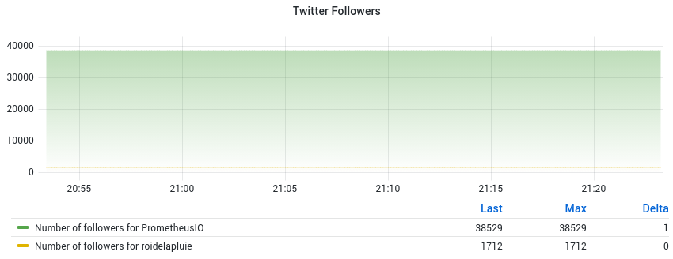

# Graphing Twitter followers with Prometheus and Grafana

This is an json_exporter setup that enables you to graph your twitter followers
with Prometheus and Grafana.




Components:

1. [json_exporter](https://github.com/prometheus-community/json_exporter)
2. [prometheus](https://prometheus.io)
2. [grafana](https://grafana.com/)

## Twitter API access

You will need a [Twitter Application with a Bearer
Token](https://developer.twitter.com/en/docs/authentication/oauth-2-0) to make
this work.

Put the bearer token into a file, you will need it further.

## json_exporter

Setup and install the json exporter.

Create a configuration file called `config.yml` for `json_exporter`.

```yaml
---
metrics:
- name: twitter_followers
  path: "{ .data.public_metrics.followers_count }"
  labels:
    username: '{.data.username}'
  help: Number of twitter followers.
http_client_config:
  bearer_token_file: twitter-bearer
```

Launch `json_exporter`:

```
./json_exporter --web.listen-address="127.0.0.1:7979"
```

## Prometheus

[Install and setup
Prometheus](https://prometheus.io/docs/prometheus/latest/getting_started/).


```
global:
  scrape_interval:     15s
  evaluation_interval: 15s

scrape_configs:
  - job_name: 'json_probe'
    metrics_path: /probe
    relabel_configs:
    - source_labels: [__address__]
      target_label: __param_target
      replacement: "https://api.twitter.com/2/users/by/username/$1?user.fields=public_metrics"
    - source_labels: [__address__]
      target_label: instance
    - target_label: __address__
      replacement: 'localhost:7979'
    scrape_interval: 30s
    static_configs:
    - targets:
      # List of usernames.
      - roidelapluie
      - prometheusio
  - job_name: 'prometheus'
    static_configs:
    - targets: ['localhost:9090']
  - job_name: 'json_exporter'
    static_configs:
    - targets: ['localhost:7979']
```

Let's drill down the interesting part, the `json_probe` configuration.


First, we define the job name.

```
  - job_name: 'json_probe'
```

Then, we tell prometheus which endpoints it needs to use. In this case, /probe
will do the json-to-metrics conversion.

```
    metrics_path: /probe
```

Relabeling enables us to have just a list of users, and let Prometheus turn that
list into a list of calls to the twitter endpoints:

First relabeling rule will turn the list of targets into the http parameter called `target`.
This takes the targets list and includes it into the twitter api endpoints.

```
relabel_configs:
- source_labels: [__address__]
  target_label: __param_target
  # API endpoint of the twitter API. We are injecting the username as parameter ($1).
  replacement: "https://api.twitter.com/2/users/by/username/$1?user.fields=public_metrics"
```

Next relabeling rule ensure that the instance label is unique, by setting it to
the username (at this point still stored in the `__address__` label).

```
- source_labels: [__address__]
  target_label: instance
```

Last rule fixes the actual address to `localhost:7979`, the `json_exporter` address.

```
- target_label: __address__
  replacement: 'localhost:7979'
```


## Enjoy!

You can now [setup
grafana](https://grafana.com/docs/grafana/latest/installation/) and create a
dashboard with the following query:

```
twitter_followers{job="json_probe",instance!="localhost:7979"}
```

You can add a legend: `Number of followers for {{username}}`.
